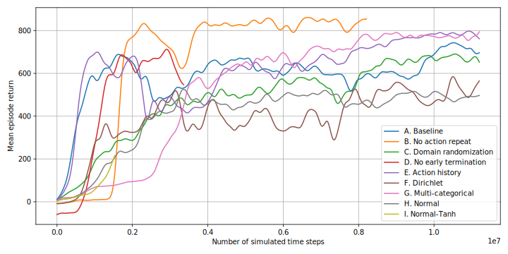
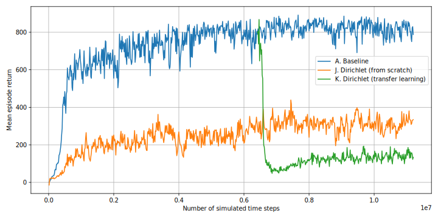
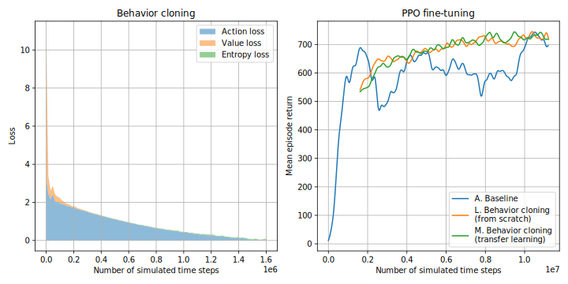
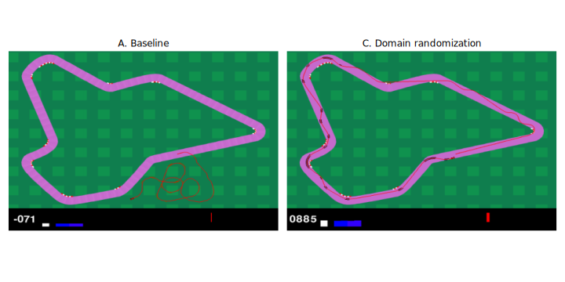
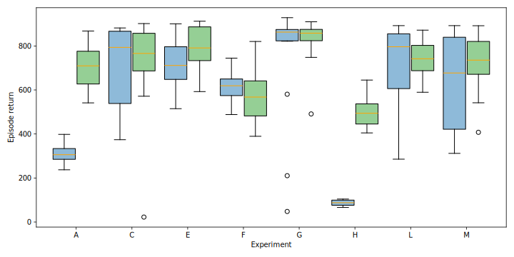
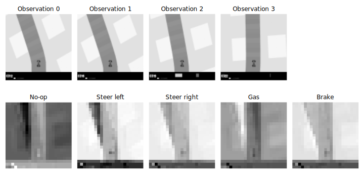

# Training CarRacing Agents Using Proximal Policy Optimization

## Introduction

This project investigates how various reinforcement learning techniques affect policy performance in the CarRacing-v3 environment from Gymnasium. The environment provides pixel observations, and agents must learn to control steering, gas, and brake to complete procedurally generated loop tracks. Starting from a baseline PPO agent with categorical action outputs, we explore design choices including alternative action representations, action history input, behavior cloning, and transfer learning.

The baseline configuration is among the most sample-efficient, achieving acceptable performance with minimal tuning. More expressive action distributions can improve performance marginally but incur greater training cost and instability. Combining behavior cloning with PPO fine-tuning shows promise for training more refined policies efficiently. We also present a preliminary attempt at policy explainability using GradCAM, a gradient-based saliency method for convolutional networks.

## Experiments

### Baseline Setup

- The environment runs at 50 Hz, but to simulate lower-frequency control, actions are repeated every 8 frames (6.25 Hz). Observations downsampled and rewards are accumulated accordingly.
- To improve sample efficiency, training terminates an episode early if the average reward over the past 100 steps drops below -0.1.
- The action space consists of 5 discrete atomic actions: no-op, steer left, steer right, gas, and brake. A categorical distribution is used to sample actions.
- PPO is used with entropy regularization (inspired by SAC) and gradient clipping. Each epoch collects 2000 environment steps and performs mini-batch Adam updates (batch size = 64).
- The learning rate is set to 3e-4 for the first 500 epochs and reduced to 6e-5 for the next 200.

### Experiment Variants

Each of the following 13 experiments (labeled A–M) modifies one or a few aspects of the baseline to isolate their effects.

Environment and architecture variations:

- A: Baseline setup.
- B: Action repeat is disabled; control is executed at full 50 Hz.
- C: Domain randomization is enabled—each episode has a new color palette.
- D: Early termination is disabled; all episodes run the full 2000 steps.
- E: The last 4 actions are concatenated to the observation input to provide action history.

Action representation variants:

- F: Dirichlet. The five atomic actions are combined using weights sampled from a Dirichlet distribution, forming a convex mixture. (Note: this is an unusual setup and may introduce ambiguous semantics.)
- G: Multi-categorical. The action space is factorized: steering, gas, and brake are treated as three independent discrete variables, each with 5 levels.
- H: Normal. A Gaussian distribution outputs continuous action vectors, with learnable mean and global standard deviation. Actions are clipped to the valid range.
- I: Normal-Tanh. Similar to H, but samples are passed through `tanh` and rescaled, avoiding hard clipping artifacts.

Behavior cloning and transfer learning:

- L: A Gaussian-policy student is initialized via behavior cloning from a partially trained baseline (epoch 100), then fine-tuned for 400 epochs using PPO.
- M: Same as L, but the student reuses and freezes the CNN backbone from the baseline. Only the policy and value heads are trained.

### Evaluation Criteria

Agents are evaluated across four axes:

- Episode return: total reward per episode.
- Sample efficiency: number of environment steps needed to reach an episode return threshold.
- Qualitative analysis: visual inspection of trajectories and action profiles.
- Explainability: GradCAM is applied to the CNN layers of discrete-action agents to visualize input saliency.

Each agent is evaluated in both stochastic mode (actions sampled from the policy distribution) and deterministic mode (MAP or mean actions), as these can yield notably different performance in practice.

## Results

### Agents in Action

**A. Baseline (stochastic mode):** The agent completes the lap but exhibits zig-zag steering behavior.

https://github.com/user-attachments/assets/9647bc75-484f-4fae-9bd6-783ef853c0ae

**A. Baseline (deterministic mode):** The car moves abnormally slowly because the MAP action often resolves to "no-op," failing to apply throttle.

https://github.com/user-attachments/assets/a68c4987-d86f-4fe1-b742-dd77caac34e7

**B. No Action Repeat (stochastic mode):** The agent completes the lap efficiently, benefiting from high-frequency control and rapid steering adjustments.

https://github.com/user-attachments/assets/5f0d4330-b247-4102-a9bf-1f598abe1d36

**C. Domain Randomization (stochastic mode):** Despite randomized visual appearance, the agent’s behavior closely resembles that of the baseline, suggesting the limited impact of domain variation on policy execution.

https://github.com/user-attachments/assets/754ea369-81c5-4fc9-ba3f-fd4f9fbf30ff

**F. Dirichlet (deterministic mode):** The trajectory is notably smooth, particularly during turns, indicating fine-grained steering control. However, overall speed remains low, limiting episode return.

https://github.com/user-attachments/assets/d7277912-0d65-46a8-aff0-d90b1f09a537

**G. Multi-Categorical (deterministic mode):** This policy achieves the highest episode return by using an aggressive driving strategy with frequent acceleration and braking.

https://github.com/user-attachments/assets/a4affeff-7742-47cc-ba03-2fc1181f1aee

**H. Normal (deterministic mode):** The agent drives at high speeds rarely encountered during training, leading to instability and frequent off-track sliding.

https://github.com/user-attachments/assets/224a3f56-fa67-422f-a059-1023e72c214b

### Performance Overview

The following plot shows episode return curves over the course of training. Experiment B, which increases control frequency by disabling action repeat, achieves the highest returns. This suggests that finer-grained control allows more precise maneuvering. In contrast, Experiment I (Normal-Tanh) suffers from early training failure due to NaNs, likely caused by numerical instability. Regularization or bounded standard deviations may be necessary to mitigate this.

Among the remaining variants, adding action history (E) and switching to a multi-categorical action space (G) yield modest improvements. However, continuous control variants—Dirichlet (F) and Normal (H)—generally underperform in this task. In terms of sample efficiency, both the baseline (A) and history-augmented model (E) reach competent performance within 1 million steps, while other variants require significantly more interaction.

### Dirichlet Policy Interpolation

The next figure evaluates whether Dirichlet distributions can effectively interpolate between discrete actions.

- Experiment J trains a Dirichlet policy from scratch over the 5 atomic actions. It converges to a low return (~300) and fails to leverage the expressivity of the action space.
- Experiment K attaches a Dirichlet head to a pretrained categorical policy. Initially, the Dirichlet head replicates the sharp action peaks of the categorical policy, but subsequent PPO fine-tuning destabilizes performance and causes collapse.

These results suggest that using a Dirichlet distribution to interpolate between discrete actions fails to provide meaningful advantages in this setting. With high concentration parameters, the Dirichlet distribution collapses to behavior similar to a categorical policy, while low concentration leads to overly diffuse action samples that fail to guide learning effectively.

### Behavior Cloning and Transfer Learning

The following figure shows the training curves for behavior cloning followed by PPO fine-tuning.

- In Experiment L, a Normal-distribution policy is initialized by cloning trajectories from a partially trained categorical teacher (epoch 100). The critic converges rapidly, while the actor takes longer to match performance.
- Experiment M uses the same setup, but reuses the teacher's CNN backbone with frozen weights, training only the actor and critic heads.

In both cases, the student initially underperforms but eventually matches or exceeds the teacher's performance during PPO fine-tuning. These results support the idea that training a compact, discrete-action teacher and transferring its knowledge to a continuous-action student provides a strong initialization. This approach combines the sample efficiency and stability of discrete policies with the flexibility of continuous control.

### Domain Randomization

Domain randomization (C) significantly slows training, yet the final performance only drops marginally—likely due to insufficient training budget rather than inherent difficulty. When the baseline agent (A) is tested in a randomized domain without adaptation, it frequently fails by veering off track, indicating poor generalization.

### Deterministic vs. Stochastic Policy Evaluation

Agents are evaluated on 16 randomly sampled test tracks in both stochastic (actions sampled from the policy distribution) and deterministic (MAP or mean actions) modes. Results are summarized in the boxplots below.

- Multi-categorical (G) consistently performs best in both modes, showing robustness and high expressivity.
- Baseline categorical (A) performs poorly in deterministic mode due to an inability to express fractional actions. During stochastic execution, the agent maintains moderate speed by randomly alternating between "gas" and "no-op" actions—a viable strategy for simulating partial acceleration. However, in deterministic mode, the most probable action is consistently selected, often resulting in no gas being applied at all. This exposes a limitation of PPO: while it learns effective stochastic policies, it does not necessarily produce performant deterministic counterparts, especially when the action space is coarse and lacks the expressiveness needed for smooth control.
- Normal (H) policies exhibit the opposite behavior: stochastic steering induces oscillations that unintentionally regulate speed, while deterministic control often leads to excessive acceleration and loss of traction.
- Minor modifications like domain randomization (C), action history (E), and behavior cloning (L, M) don’t improve training returns dramatically, but significantly enhance robustness across evaluation modes. Notably:
  - C, E outperform the baseline in deterministic mode.
  - L, M (behavior cloned and fine-tuned normal policies) outperform the pure PPO-trained Normal policy (H) in both modes.

### Policy Explainability via GradCAM

Finally, we apply GradCAM (LayerCAM variant) to the second convolutional layer of the baseline model to visualize input saliency across action types.

Key observations:

- The no-op action relies heavily on the most recent frame.
- Steering and braking actions focus on earlier frames, suggesting use of motion cues.
- Gas shows strong activation aligned with track curvature. While this may resemble a poor driving habit (accelerating into turns), it could be a reward-maximizing strategy under the current reward signal.

